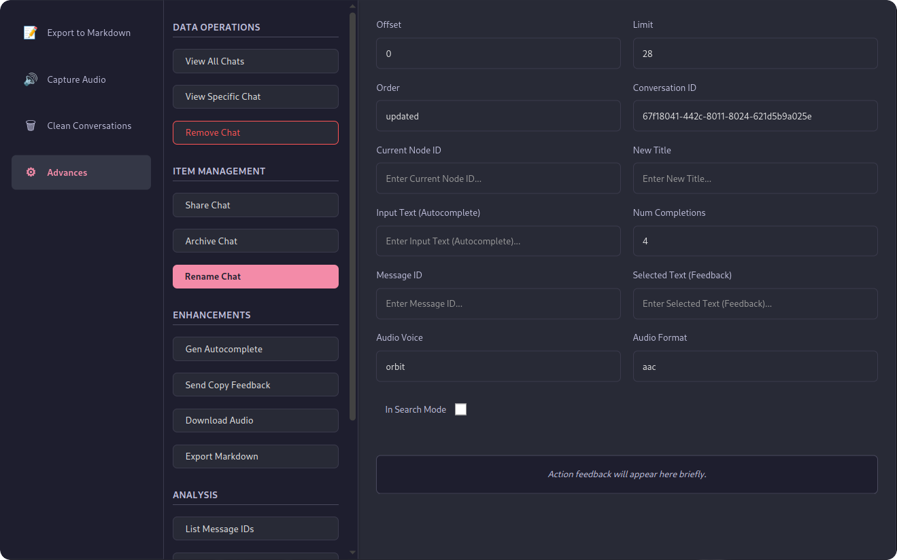

<!-- # ChatGPT Reverse -->

<p align="center">
  
</p>

<p align="center">
  
</p>

<p align="center">
  <a href="./LICENSE"></a>
  <a href="https://semver.org"></a>
</p>

## Overview

This is a Chrome Extension designed to interact with ChatGPT, leveraging potentially reverse-engineered API calls. It adheres strictly to the Manifest V3 (MV3) architecture.

The project is structured as a **monorepo** using **pnpm workspaces** to enforce modularity and separation of concerns between the different parts of the extension.

## Technology Stack

*   **Package Manager:** [pnpm](https://pnpm.io/) (using workspaces)
*   **Bundler/Build Tool:** [Vite](https://vitejs.dev/)
*   **Language:** [TypeScript](https://www.typescriptlang.org/)
*   **UI (Popup):** [React](https://react.dev/)
*   **Linting/Formatting:** [Biome](https://biomejs.dev/)
*   **Extension Framework:** Manifest V3 (MV3)

## Project Structure

The monorepo is organized into several distinct packages within the `packages/` directory, plus root configuration and static assets:

*   `packages/popup`: Contains the React code for the extension's popup UI (`action.default_popup`).
*   `packages/content-script`: Code injected into and interacting with web pages (specifically `chatgpt.com` as per the manifest).
*   `packages/service-worker`: The background service worker handling core logic, event listeners, and message passing (MV3 standard).
*   `packages/shared`: Common TypeScript types, utility functions, constants, etc., shared across other packages. Built independently using `tsc`.
*   `packages/interceptor`: A dedicated script, likely for intercepting network requests, intended to be injected into the page context. Built as an IIFE.
*   `packages/loadscript`: A utility script, likely responsible for injecting other scripts (like the interceptor) into the page context. Built as an IIFE.
*   `public/`: Contains root-level static assets for the extension, primarily `manifest.json` and icons. These are copied directly into the build output.
*   `build/`: **(Generated)** The output directory containing the final, loadable Chrome extension package.

Each package (`content-script`, `service-worker`, `interceptor`, `loadscript`, `popup`) utilizes its own `vite.config.ts`, configured for its specific output requirements (IIFE for injected scripts, ES module for service worker, standard build for popup).

## Prerequisites

*   [Node.js](https://nodejs.org/) (Version 20 or later recommended)
*   [pnpm](https://pnpm.io/installation) (Version 8 or later recommended)
*   [Docker](https://www.docker.com/get-started/) (Optional, for containerized builds)

## Setup

Clone the repository and install dependencies using pnpm:

```bash
git clone <repository-url>
cd chatgpt-reverse
pnpm install
```

## Development

To build the packages and watch for changes during development:

```bash
pnpm dev
```

This command typically runs the `dev` script within each package (often `vite build --watch` or `tsc -b --watch`).

**Loading the Extension for Development:**

1.  Run `pnpm build` once initially (or `pnpm dev` and wait for the initial build).
2.  Open Chrome/Edge and navigate to `chrome://extensions/`.
3.  Enable "Developer mode" (usually a toggle in the top-right corner).
4.  Click "Load unpacked".
5.  Select the `build` directory generated at the root of this project.

**Important Notes for Development:**

*   Changes to the **popup** code might require reopening the popup to see updates (unless React Fast Refresh is working perfectly via the dev server, which isn't the primary mode here).
*   Changes to the **service worker** (`background.js`) often require reloading the extension via the `chrome://extensions/` page (click the reload icon for the extension).
*   Changes to **content scripts**, **loadScript**, or **interceptor** require reloading the extension *and* refreshing the target web page (`chatgpt.com`) where they are injected.

## Building for Production

There are several ways to build the production-ready extension:

**1. Using pnpm (Recommended for local builds):**

This is the standard method. It cleans the output directory, builds all packages sequentially, and copies public assets into the final `build` directory.

```bash
pnpm build
```

The loadable extension will be located in the `build/` directory at the project root.

**2. Using Docker:**

This method builds the extension inside a container, ensuring a consistent environment (useful for CI/CD).

*   **Build the Docker image:**
    ```bash
    docker build -t chatgpt-reverse-extension .
    ```
    This creates an image named `chatgpt-reverse-extension`. The build artifacts are located inside the image at `/extension_build`. You would typically extract these artifacts in a CI/CD pipeline or use multi-stage builds to copy them elsewhere.

*   **Build using Docker Compose (Less common just for building):**
    ```bash
    docker compose build
    ```
    If the compose file includes a volume mount (`volumes: - ./build:/extension_build`), the built extension will also appear in the `./build` directory on your host machine. Otherwise, the artifacts are within the container created by compose.

*   **How to Retrieve the Output from the Built Docker Image(s):**

    The command `docker compose build` does exactly what its name implies: it **builds the Docker image(s)** defined in your `docker-compose.yml` file, following the instructions in your `Dockerfile`. It **does not** automatically run a container from that image, nor does it automatically copy files *out* of the built image back onto your host machine.

    The build artifacts (the contents of your `build/` directory) now exist *inside* the newly built Docker image, specifically at the `/extension_build` path within the image's filesystem. They were **not** created on your host filesystem.

    To access them, we need to manually extract the contents from the built Docker image into our host filesystem, specifically into the root of our project.

    **1. Clean Up Existing `build` Directory (if it exists):**
    
    ```bash
    rm -rf ./build
    ```
    **2. Create a Temporary Container:**
    
    Use `docker create` to make a container based on the image *without starting it*. We'll give it a temporary name like `extractor_container`.

    ```bash
    # Only run this if 'extractor_container' doesn't exist
    docker create --name extractor_container chatgpt-reverse-build
    ```

    **3. Copy Files from the Container to Your Host:**

    Use the `docker cp` command. The syntax is `docker cp <container_name>:<path_inside_container> <path_on_host>`.

    ```bash
    docker cp extractor_container:/extension_build/. ./build
    ```
    **4. Check Ownership (After Copying):**

    If the copy now succeeds without error, check the ownership of the newly created `./build` directory and its contents:

    ```bash
    ls -ld ./build
    ls -l ./build
    ```
    
    If they are owned by `root` instead of your user (`myusername`), change the ownership back:

    ```bash
    # Replace 'myusername' with your actual username if different
    sudo chown -R myusername:myusername ./build
    ```
    **5. Remove the Temporary Container:**

    Don't forget to clean up:

    ```bash
    docker rm extractor_container
    ```

## Linting and Formatting

This project uses Biome for linting and formatting.

*   **Check formatting and linting:**
    ```bash
    pnpm biome check .
    # Or run separately:
    # pnpm biome format .
    # pnpm biome lint .
    ```
*   **Apply formatting and safe lint fixes:**
    ```bash
    pnpm biome check --apply .
    # Or run separately:
    # pnpm biome format --write .
    # pnpm biome lint --apply .
    ```

## Testing

*   **Run all tests:**
    ```bash
    pnpm test
    ```
*   **Run tests in watch mode:**
    ```bash
    pnpm test:watch
    ```

## License

This project is licensed under the ISC License. See the [LICENSE](./LICENSE) file for details.


